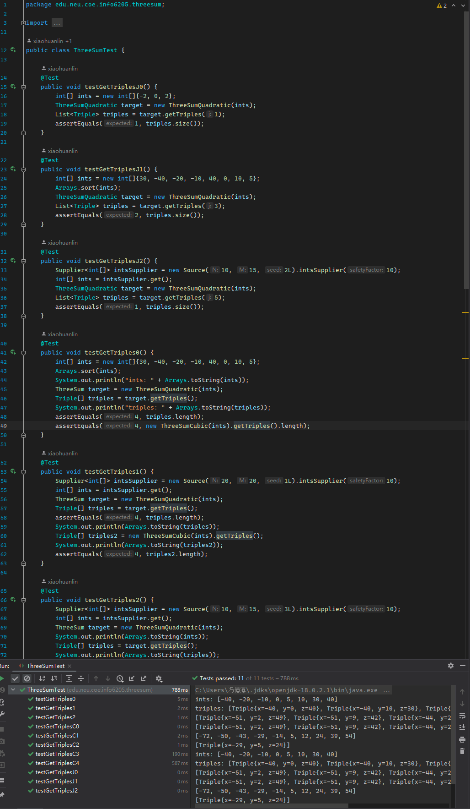
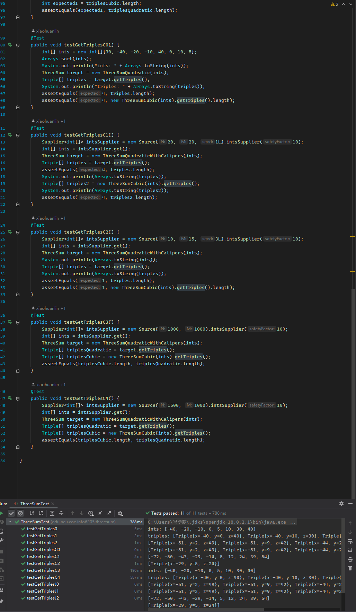

# INFO6205 Assignment 2 (3-SUM)

NAME: Bohan Feng	
NUID: 001564249
Repository: [https://github.com/fengb3/INFO6205](https://github.com/fengb3/INFO6205)
## Assignment02 Three Sum

### a) Screenshots of unit testing code and test pass


 
 

### b) Spread sheet showing timing observations

| N    | ThreeSumQuadratic | ThreeSumQuadrithmic | ThreeSumCubic |
| ---- | ----------------- | ------------------- | ------------- |
| 250  | 1.95              | 2.17                | 8.57          |
| 500  | 2.01              | 3.7                 | 21.94         |
| 1000 | 4.87              | 14.18               | 135.8         |
| 2000 | 15.74             | 56.7                | 952.79        |
| 4000 | 57.1              | 241.13              | 7306.84       |

### c)  Explanation of why quadratic method works

code : 

```java
    public Triple[] getTriples() {
        List<Triple> result = new ArrayList<>();
        int length = a.length;

        // check validation
        if(a == null || length < 3)
            return result.toArray(new Triple[0]);

        // sort the array
        Arrays.sort(a);

        // first loop from start to end of the array
        for(int i = 0; i < length - 2; i++)
        {
            // science the array is sorted, there is not a chance that sum is 0, if we loop to a number that is bigger than 0
            if(a[i]>0)
                break;
            
            // skip if we meet duplicate number
            if(i > 0 && a[i] == a[i - 1])
                continue;

            // 2 pointers that loop from start and end to the center
            int left = i + 1;
            int right = length - 1;

            // second loop
            while(left < right)
            {
                int sum = a[i] + a[left] + a[right];

                // check the sum
                if(sum == 0)
                {
                    // if the sum is 0, which is what we want, remember it
                    result.add(new Triple(a[i], a[left], a[right]));

                    // then move 2 pointer one step the the center
                    left++;
                    right--;

                    // skip duplicate numbers
                    while(left < right && a[left] == a[left - 1])
                        left++;

                    while(left < right && a[right] == a[right + 1])
                        right--;
                }
                // if the sum is smaller than 0, we need to move left pointer, to make the sum bigger to approach 0
                else if(sum < 0)
                    left++;
                
                // similarly, move the right pointer to make the sum small to approach 0
                else
                    right--;
            }
        }

        return result.stream().distinct().toArray(Triple[]::new);
    }
```

The quadratic method is basicly an optimized version of cubic method.

In cubic method, we have three layer of loops to find 3 numbers.

In quadratic method, we combine second and thrid layer loops into a 2 pointer check to find second and third number we want.

In first layer we loop the array from the start to end, the check **i** th number in array.

We set up 2 pointers (**Left** and **right**) at both sides of the rest of the array.

Then we check the sum of **i**, **left** and **right**

There are 3 diffent situation in our 2 pointer check :

- if the sum is smaller than 0, we apply `left++`.

- if the sum is greater than 0, we apply `right++`.

- is the sum is equal than 0, we found one of the answer, add it to the list.

until the **left** is equal to **right**

Then we can start the next iteration of the first layer loop to find other answers

#### Time complexity

sort the array : $O(n * Logn)$, 
iterate over array : $O(n)$, 
2 pointer search : $O(n)$, 
total : $O(n * logn) + O(n) * O(n)$ => $O(n^2)$

#### Space complexity

we are not using extra space so the space conplexity is $O(1)$


