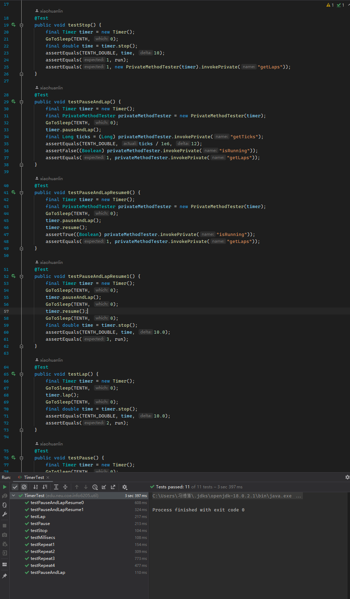

# INFO6205 Assignment 3 (Benchmark)

NAME: Bohan Feng
NUID: 001564249
Repository: [https://github.com/fengb3/INFO6205](https://github.com/fengb3/INFO6205)

## Part 1 Timer & Benchmark

### Unit Test Screenshot

Timer:

Benchmark:

<!--  -->

## Part 2 Inserrtion Sort

### Unit Test Screetshot:
<!-- 
 -->

## Part 3 Measure Running Times

### Measured Data

Table:

| n     | random   | ordered | partiallyOrdered | reversed |
| ----- | -------- | ------- | ---------------- | -------- |
| 200   | 0.0374   | 0.00516 | 0.01614          | 0.04288  |
| 400   | 0.32443  | 0.00359 | 0.19526          | 0.05365  |
| 800   | 0.10849  | 0.0065  | 0.03351          | 0.11643  |
| 1600  | 0.25289  | 0.00811 | 0.12406          | 0.45562  |
| 3200  | 0.93144  | 0.01623 | 0.56324          | 1.79383  |
| 6400  | 3.84342  | 0.03391 | 1.83933          | 7.2329   |
| 12800 | 12.86309 | 0.05785 | 6.54417          | 25.50461 |
| 25600 | 50.28089 | 0.0905  | 25.56846         | 100.8463 |

Graph:

### Obervation

I used doubling method to test the time usage of InsertionSort. For each different array length $(n)$, I tried four array sorting situations (random, ordered, inverted, and partially ordered). Based on the output data and charts, we can briefly know that the speed of sorting ordered array is the fastest, sorting random and partially ordered arrray is slower, and sorting for reversed is the slowest.

For best situation (ordered), InsertionSort does not require a swap operation, it needs $(n - 1)$ times comparison. For worest situation(reversed), InsertionSort needs $n * (n-1) / 2$ times comparison, because when we insert nth element, we need to compare previous (n - 1) elements. InsertionSort's swap times is number of comparison operations minus $(n - 1)$. On the average, the time complexity of the InsertionSort is $O(n^2)$.

