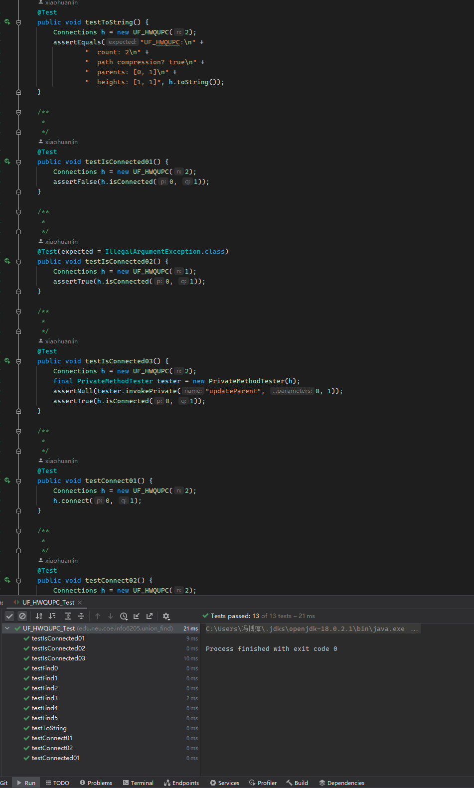
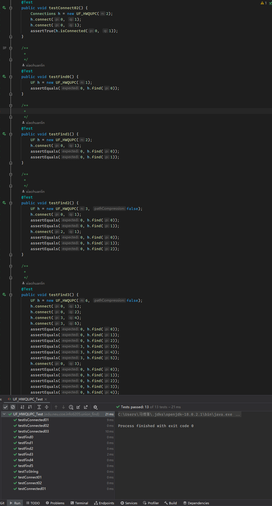
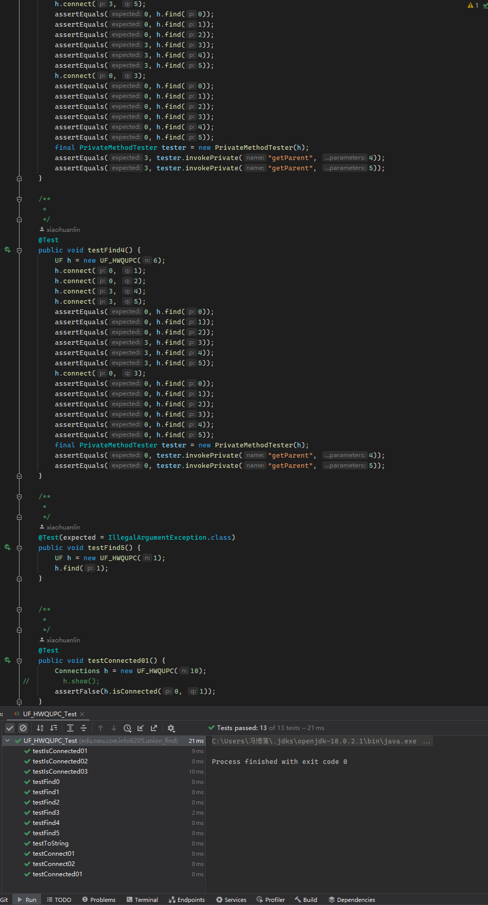

# INFO6205 Assignment 4 (WQUPC)

NAME: Bohan Feng	
NUID: 001564249
Repository: [https://github.com/fengb3/INFO6205](https://github.com/fengb3/INFO6205)

## Step 01

Screen shot for test case passed without modifing test code

## Step 02

Use UF_HWQUPC to implement static method to findout the how may connection will be created with a given number of "sites"

## Step 03

Determine the relationship between the number of objects ($n$) and the number of pairs ($m$) generated to accomplish reducing the number of components from n to 1

Based on my observation the releationshoip between $m$ and $n$ is

$$m = k*n*lg(n)$$ where $k$ is a constant which approximately equal to 3.7

Evidence:

On the screenshot of spreadsheet and graph above, I found that $m/n*lg(n)$ is always a constant (when $n$ is a large number). 