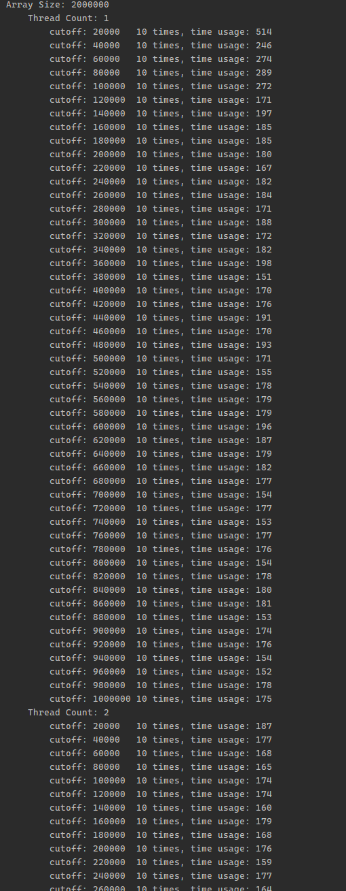

# INFO6205 Assignment 5 (Parallel Sorting)

NAME: Bohan Feng	
NUID: 001564249
Repository: [https://github.com/fengb3/INFO6205](https://github.com/fengb3/INFO6205)

## Output result

the console output looks like this

## Graph

I try 5 different value for size of array (2 million to 10 million). The cutoff value increasing based on the percentage of array size.

### Array Size 2,000,000

### Array Size 4,000,000

### Array Size 6,000,000

### Array Size 8,000,000

### Array Size 10,000,000

### Observation

In the chart above, we can see the cutoff value is above 25% of arraysize, the parallel sorting proformence better than cutoff value smaller than 25% of arraysize.

For number of threads, it seems that the more threads we have the faster the algorthm sort the array. For threads number more than 16, there is no obvious difference.

### More Observation

Then I try to extent the percentage of array size as cutoff value (1% - 90%) to see how cutoff value effect sorting speed.

In some intervals of cutoff values, the sorting time tends to be stable.

(50% - 100%], (25% - 50], (12.5% - 25%],(6.25%,-12.5%] ...

in generally, this interval is $(1/(n+1)^2, (1 / n)]$ where $n = 1,2,3,4 ... etc$

The larger n, the lower the efficiency of sorting. When the cutoff value is greater than 50% of the array size, the sorting efficiency is the highest and tends to be stable.

Multithreading is always more efficient than single threading. When the number of threads is greater than or equal to 2, the increase of threads will bring more obvious improvement when the cutoff value is lower. As the cutoff value increases, the improvement brought by increasing the number of threads is not obvious

## Conclusion

Since we are using a merge sort strategy, this strategy requires dividing the array into halfs. The number of dividing operation depends on the cutoff value. This results in increasing the dividing operation to $n$ times when the cutoff is less than $1/n^2$, where $n >= 2$. This is why the sorting time is different between the previously mentioned intervals

When the cutoff value is smaller, in an other word when there are more partitions. Using more threads results in significant performance gains. However, whenever two adjacent partition are sorted and merged, some threads will be idle and not participate in the rest of the sorting. So when the cutoff value is too small, the sorting efficiency is low.

Since our algorithm will split the array into two parts at least once. when the cutoff value is large, there will be two threads participating in the sorting, and the remaining threads will be idle, which will result in when the cutoff is greater than 50% of the array size, no matter how many threads we set, the algorithm efficiency are not improved.

For parallel sorting, the best strategy is to **set the cutoff value greater than 50% of the array size, and use two threads.**

### possible improvement

make those idle threads participate in soring rest of the array.

